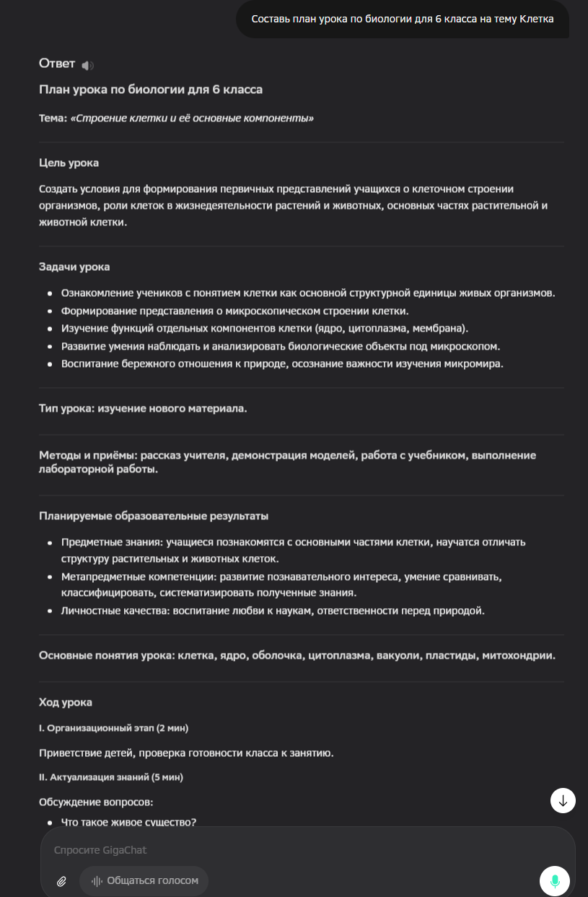
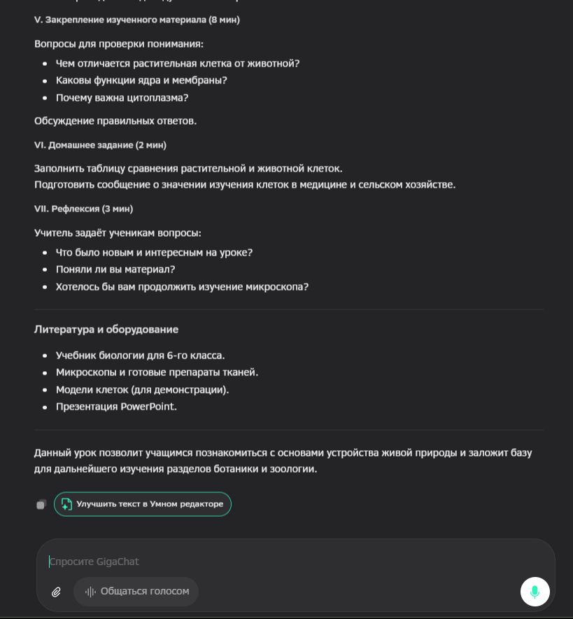
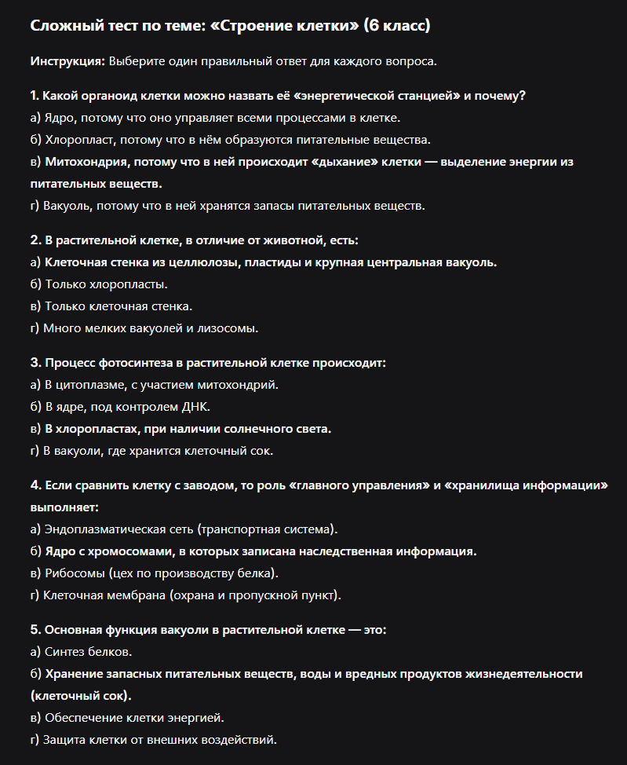
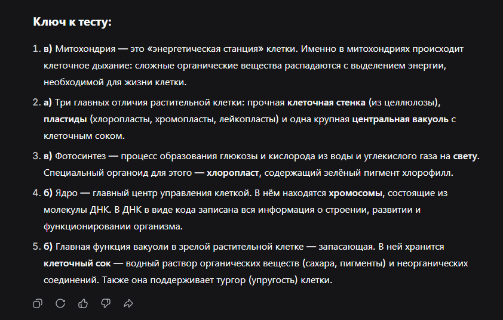

# Лабораторная работа №1: Подбор инструментов ИИ для задач педагога

**Выполнил:** Гриненко Никита Дмитриевич
**Группа:** 2 курс ПОО
**Предмет:** Основы искусственного интеллекта

## Задание 1. Анализ типовых задач педагога

### 1.1. Перечень задач
| № | Задача | Категория | Частота | Трудоёмкость (1-5) |
|---|---|---|---|---|
| 1 | Составление поурочного плана | Планирование | Ежедневно | 4 |
| 2 | Создание вариантов контрольной работы | Контроль | Еженедельно | 4 |
| 3 | Проверка эссе и сочинений | Оценивание | Еженедельно | 5 |
| 4 | Генерация презентаций к уроку | Визуализация | Ежедневно | 4 |
| 5 | Подготовка списка литературы по теме | Документооборот | Ежемесячно | 2 |
| 6 | Перевод учебных материалов | Контент | Редко | 3 |
| 7 | Адаптация сложного текста для 5 класса | Контент | Еженедельно | 3 |
| 8 | Создание интерактивных тестов | Контроль | Еженедельно | 4 |
| 9 | Ответы на типичные вопросы родителей | Коммуникация | Ежедневно | 3 |
| 10 | Написание отчета за четверть | Административные | Раз в четверть | 5 |
| 11 | Создание иллюстраций для заданий | Визуализация | Еженедельно | 3 |
| 12 | Транскрибация видеолекции в текст | Контент | Редко | 4 |
| 13 | Составление расписания доп. занятий | Административные | Ежемесячно | 2 |
| 14 | Подбор тем для проектной деятельности | Планирование | Раз в год | 3 |
| 15 | Сбор и анализ статистики успеваемости | Оценивание | Раз в четверть | 4 |

### 1.2. Приоритизация задач (ТОП-5 для автоматизации)
| № приоритета | Задача | Потенциал автоматизации (%) |
|---|---|---|
| 1 | Создание тестов и контрольных | 90% |
| 2 | Адаптация и упрощение текстов | 85% |
| 3 | Проверка письменных работ (эссе) | 80% |
| 4 | Генерация презентаций | 70% |
| 5 | Написание отчетов и планов | 60% |

## Задание 2. Подбор инструментов

### 2.1. Матрица инструментов (под приоритетные задачи)

| Задача | Отечественный инструмент | Зарубежный бесплатный | Open-Source (локальный) |
|---|---|---|---|
| **1. Создание тестов** | Online Test Pad | Google Forms (+ ИИ) | TAO Testing |
| **2. Адаптация текстов** | YandexGPT | Qwen | Ollama (Llama 3) |
| **3. Проверка эссе** | GigaChat | DeepSeek | AnythingLLM |
| **4. Презентации** | DiaClass | Gamma.app | LibreOffice Impress |
| **5. Планы и отчеты** | GigaChat | Kimi | Jan |

## 2.2. Тестирование инструментов

### Инструмент 1: GigaChat (Отечественное решение)
**Задача:** Составление плана урока по биологии для 6 класса на тему «Клетка».
**Промт:** *«Составь план урока по биологии для 6 класса на тему Клетка»*

| Параметр | Оценка (1-5) | Комментарий |
|---|---|---|
| Качество результата | 5 | План содержит все необходимые этапы: цели, задачи, ход урока, закрепление и рефлексию. |
| Поддержка русского языка| 5 | Текст методически грамотный, без ошибок. |
| **Итоговая оценка** | **5** | Отличный результат для быстрой подготовки к занятиям. |

**Результат работы:**

---

### Инструмент 2: Шедеврум (Отечественное решение)
**Задача:** Генерация иллюстрации строения растительной клетки для презентации.
**Промт:** *«Строение растительной клетки, биологическая иллюстрация для учебника, вид под микроскопом, четкие детали, высокая детализация»*

| Параметр | Оценка (1-5) | Комментарий |
|---|---|---|
| Качество изображения | 3 | Визуально картинка яркая, но биологически неточная. Структура больше напоминает срез арбуза, чем реальную клетку. |
| Удобство использования | 5 | Быстрая генерация, понятный интерфейс на русском языке. |
| **Итоговая оценка** | **4** | Требует очень точного подбора промптов для получения научной достоверности. |

**Результат работы:**

---

### Инструмент 3: DeepSeek (Зарубежное решение)
**Задача:** Генерация сложного проверочного теста по теме «Клетка».
**Промт:** *«Составь сложный проверочный тест из 5 вопросов про строение клетки для 6 класса с вариантами ответов и ключом в конце»*

| Параметр | Оценка (1-5) | Комментарий |
|---|---|---|
| Логика вопросов | 5 | Вопросы действительно требуют понимания материала, а не простого зазубривания. |
| Точность ключей | 5 | Все ответы в ключе соответствуют вопросам, логических ошибок нет. |
| **Итоговая оценка** | **5** | Мощный инструмент для создания контрольно-измерительных материалов. |

**Результат работы:**

---

## Задание 3. Анализ дополнительных возможностей

### 3.1. Выявление неочевидных задач
| № | Задача/Подзадача | Почему её часто упускают | Потенциальный инструмент |
|---|---|---|---|
| 1 | Генерация идей для проектов | Считается творческой задачей | GigaChat, DeepSeek |
| 2 | Адаптация текста под УВЗ | Требует много времени | YandexGPT, Qwen |
| 3 | Создание субтитров к урокам | Технически сложно | SaluteSpeech, Whisper |
| 4 | Написание сказок для терминов | Кажется несерьезным методом | GigaChat, Kandinsky |
| 5 | Письма для родителей | Рутинная вежливая переписка | YandexGPT |
| 6 | Критерии оценивания | Сложно продумать объективно | DeepSeek, Claude |

### 3.2. Составление ручных цепочек инструментов (Workflow)
1. **GigaChat:** Генерация плана урока и базового текста лекции.
2. **DeepSeek:** Создание набора тестов на основе подготовленной лекции.
3. **Шедеврум:** Создание тематических иллюстраций для слайдов презентации.
4. **Online Test Pad:** Публикация теста в интерактивном формате для учеников.

## Задание 4. Сравнительный анализ

### 4.1. Сравнение языковых моделей (LLM)
| Критерий | GigaChat | YandexGPT | DeepSeek | Qwen |
|---|---|---|---|---|
| Качество рус. языка | Отличное | Отличное | Хорошее | Хорошее |
| Скорость генерации | Высокая | Высокая | Средняя | Высокая |
| Контекстное окно | 200K токенов | Среднее | 128K токенов | Среднее |
| Работа с кодом | Средне | Средне | Отлично | Хорошо |
| Мультимодальность | Да (генерация) | Да (поиск) | Нет (R1) | Да (Vision) |
| Доступность в РФ | Без VPN | Без VPN | Без VPN | Без VPN |
| Стоимость | Бесплатно | Бесплатно | Бесплатно | Бесплатно |
| Наличие API | Есть | Есть | Есть | Есть |

### 4.2. Выводы
1. Для разработки методических материалов на русском языке эффективнее использовать **GigaChat**.
2. Для создания визуального контента **Шедеврум** является самым быстрым решением, но требует проверки на "галлюцинации".
3. Связка ИИ-инструментов позволяет автоматизировать до 70% рутинной подготовки педагога.

## 5. Итоговый набор инструментов
Мой выбор: **GigaChat** (планирование), **Шедеврум** (визуализация), **DeepSeek** (тестирование).